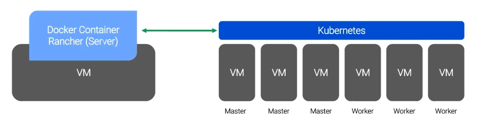

 # Installieren einer RANCHER Testumgebung

### Empfehlung für den Anfang

```
Host:
Docker + Rancher Container
VMs:
node1: etcd + control plane + worker
node2: worker
node3: worker
```

### Server Sizing

```
4 CPUs und 8 GB RAM
```



 ### Installation von Ubuntu 24.04 LTS
Updates installieren
```
apt update && apt-upgrade -y
```

Docker installieren
```
# Add Docker's official GPG key:
sudo apt update
sudo apt install ca-certificates curl
sudo install -m 0755 -d /etc/apt/keyrings
sudo curl -fsSL https://download.docker.com/linux/ubuntu/gpg -o /etc/apt/keyrings/docker.asc
sudo chmod a+r /etc/apt/keyrings/docker.asc

# Add the repository to Apt sources:
sudo tee /etc/apt/sources.list.d/docker.sources <<EOF
Types: deb
URIs: https://download.docker.com/linux/ubuntu
Suites: $(. /etc/os-release && echo "${UBUNTU_CODENAME:-$VERSION_CODENAME}")
Components: stable
Architectures: $(dpkg --print-architecture)
Signed-By: /etc/apt/keyrings/docker.asc
EOF

sudo apt update

sudo apt install docker-ce docker-ce-cli containerd.io docker-buildx-plugin docker-compose-plugin

#TESTEN
sudo systemctl status docker
```
SWAP deaktivieren
```
# SWAP deaktivieren

swapoff -a
nano /etc/fstab # Swap zeile ausklammern mit #
```

Hosts in /etc/hosts eintragen
```
cat << EOF >> /etc/hosts
192.168.20.130 srv-kubemast-01
192.168.20.131 srv-kubewrk-01
192.168.20.132 srv-kubewrk-02
192.168.20.133 srv-kubewrk-03
EOF
```

NTP Dienst installieren
```
apt install ntp
```

Docker Image installieren
```
docker run -d --restart=unless-stopped \
  -p 80:80 -p 443:443 \
  -v /opt/rancher:/var/lib/rancher \
  --privileged \
  rancher/rancher:latest
  ```

  Docker Image neu ausrollen
  ```
  docker ps
docker stop <ID>
docker image list
docker image remove <ID> -f
```

Nodes mit installiern
```
curl --insecure -fL https://192.168.20.130/system-agent-install.sh | sudo  sh -s - --server https://192.168.20.130 --label 'cattle.io/os=linux' --token stw87djkvw46jrp7528j8xvwwv9pb4czm72lxvfdpt69lqn796xgzd --ca-checksum a27de6c6b98a5c86c853a579af96bbbb04436497046b614df7916d80197ed853 --etcd --controlplane --worker
```

# Deinstallieren der Rancher Agenten auf den Worker Nodes

### Prüfen

```shell
systemctl status rancher-system-agent
systemctl status rke2-agent
```

### Uninstall Scirpt laufen lassen

```shell
/usr/local/bin/rke2-uninstall.sh
```
### Verzeichnisse löschen

```shell
sudo rm -rf \
/etc/rancher \
/etc/kubernetes \
/etc/cni \
/opt/cni \
/var/lib/rancher \
/var/lib/kubelet \
/var/lib/cni \
/var/lib/calico \
/run/calico \
/run/flannel

```

### CDR installieren für Gateway API

Achtung: Muss evtl. nicht mehr installiert werden zuerst mit folgendem Befehl prüfen:

''`shell
kubectl get crd | grep gateway
```

```shell

kubectl apply --server-side -f https://github.com/kubernetes-sigs/gateway-api/releases/download/v1.6.0/standard-install.yaml

# Verify installation
kubectl get crd | grep gateway
```

### GatewayClass definieren

```yaml


```


